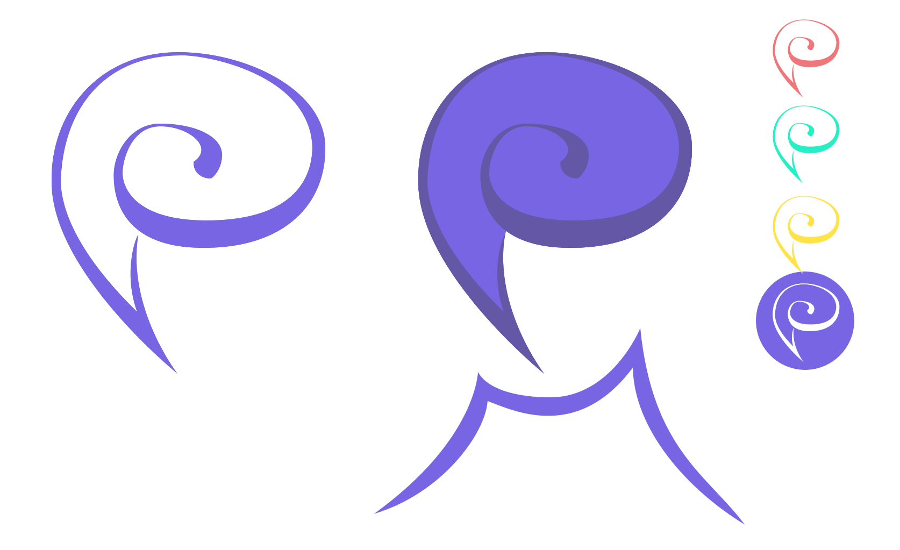

# fedicons
Icons intended for use on Fediverse sites and clients.

Made by Hugh (@y6nH).

## Licence
You are free to use these icons for any open-source project, but plese credit me - "by @y6nH" is sufficient. 

This work is licensed under a <a rel="license" href="http://creativecommons.org/licenses/by-sa/4.0/">Creative Commons Attribution-ShareAlike 4.0 International License</a>.

## Rustodon
A set of icons used in the web front-end for [Rustodon](https://github.com/rustodon/rustodon/).

* Post (speech bubble)
* Neighbourhood (local timeline)
* House (home timeline)
* Globe (federated timeline)
* Exit sign (log out)
* Gear (settings)
* Magnifying glass (search)

## Plume
A [candidate logo for Plume](https://fediverse.blog/~/PlumeDevelopment@baptiste.gelez.xyz/plume-needs-a-logo/), the federated blogging platform. The logo resembles a plume (feather), a speech bubble and the letter P.

